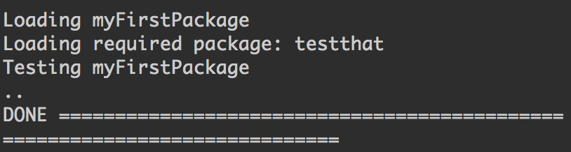
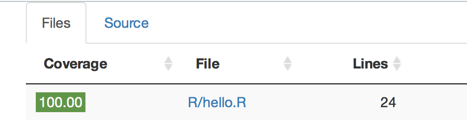

<style type="text/css">
p{ /* Normal  */
   font-size: 18px;
}
body{ /* Normal  */
   font-size: 18px;
}
td {  /* Table  */
   font-size: 14px;
}
h1 { /* Header 1 */
 font-size: 32px;
}
h2 { /* Header 2 */
 font-size: 26px;
}
h3 { /* Header 3 */
 font-size: 22px;
}
code.r{ /* Code block */
  font-size: 14px;
}
pre { /* Code block */
  font-size: 14px
}
</style>

```{r setup, include=FALSE}
knitr::opts_chunk$set(echo = TRUE)
```

# Unit Testing

The best way to check whether a programmer's code is functioning properly is by writing unit tests. The basic workflow is to write the code, write tests, and check if the code passes the tests. Let's see how can do this with a simple example using the `testthat` package.

```{r, message=FALSE, warning=FALSE}
library(testthat)
setwd("/Users/ethen/Desktop/northwestern/russ/3_tests_packages")

compute_square_root <- function(number) {
    # an overly simple wrapper function around sqrt
    # for illustration purpose
    return( sqrt(number) )
}

test_that('Test sqrt: positive numeric', {
	expected <- 2
	actual <- compute_square_root(4)
	expect_equal(expected, actual)
})

```

Hopefully the syntax should be pretty straightforward. We use the `test_that` function to conduct a single unit test, and we first give a short description of what the test is about. Then inside this function we need to define two things: the result we expect, and the actual result that is returned by the function we wish to test. In the example above, we wish to test the function `compute_square_root`, we know that the square root of 4 is 2. Thus we would use `expect_equal` to say the result of the `compute_square_root(4)` should equal to 2.

There're a bunch of different functions apart from `expect_equal` that allow us to test for a variety of situations. For example: When we like to test whether taking the square root of a negative value will generate a warning.

```{r}
# outputs a warning
compute_square_root(-4)

# test that the function will actually generate a warning
test_that('Test sqrt: negative numeric', {
	expect_warning(compute_square_root(-4))
})
```

For more options, please refer to the documentation of `testthat`.


## Packages

Developing a package makes it easier for us to our code with colleagues or even simply prevent us from copying and pasting code that we wish to use across multiple projects. To start writing a package, the easiest way is to load up Rstudio and start a new project. We can do that by going under the File menu and choose New Directory > R package and to keep it simple the package name will simply be `myFirstPackage`. After doing so, we'll see a bunch new files and folders created inside our package folder. Note that our working directory is now set to where the package sits.

The most important folder for now is the R folder, which is the folder that will hold our .R source code files. Apart from that, Rstudio will also open up a sample `hello.R` script, which we can delete. Here we'll simply be editing it.

### Documentations

Usually, we would write comments to describe what our function does, what are its inputs and outputs. `roxygen2` is a package that turns these comments into documentation. For example:

```{r, eval = FALSE}

#' Function to compute the square root of a number
#'
#' @description This function is a wrapper around the sqrt function that
#' computes the square root of a number using a loop
#'
#' @param num the number whose square root is computed
#' 
#' @return square root of the input number
#'
#' @details The function only takes in positive values
#'
#' @references None
#'
#' @examples
#' library(myFirstPackage)
#' num <- 4
#' compute_square_root(num)
#' @export
compute_square_root <- function(number) {
    return( sqrt(number) )
}

```

The first difference with standard comments is that `roxygen2` type comments start with the `#'` symbol instead of simply the `#` symbol. The fist line is a short description of what the function does. Then, we can supply different keywords to it. Common ones include: 

- `@description` for a longer description of what the function does
- `@param` that explains what each and every parameter represents
- `@return` explains the value that the function returns
- `@details` for more elaboration on the functionality of the function
- `@references` if we have any
- `@examples` for a concrete example of how to use the function
- `@export` for making the function accessible to the user. Sometimes it makes sense to not use `@export` if we want to have helper functions that are used by our other functions inside the package, and we don't want to make these functions accessible to the users.

After writing out all of these text before our function, we can then use the `roxygenise()` function from the `roxygen2` package to create the documentation files for our package.

```{r, eval=FALSE}
roxygen2::roxygenise()
```

We can now test building our package by either by clicking on the button named `Build and Reload` button which we can find inside the Build pane or by using the following keyboard shortcut: `CTRL-SHIFT-B` in Rstudio. After doing so, we can now load the library use the function inside and search for the help page of the function.

```{r, message=FALSE, warning=FALSE}
library(myFirstPackage)
compute_square_root(4)

# search for the documentation
?compute_square_root
```

### Testing Packages

Now that we know the basics of creating a package, let's apply what we know about unit testing and start testing out package. We'll simply call `devtools::use_testthat()` which will create the necessary folders to hold our tests as well as creating a `testthat.R` file with the code that gets called to run our tests. To elaborate on the necessary folders that the function created, what it's doing is creating a folder called `tests` in the root of our package and inside this tests folder create another folder, called `testthat`. The `testthat` folder will hold our unit tests. For example, inside the folder, we create a script called `test_square_root.R` and put the following code in it:

```{r}

library(testthat)
library(myFirstPackage)

test_that('Test sqrt: positive numeric', {
	expected <- 2
	actual <- compute_square_root(4)
	expect_equal(expected, actual)
})

test_that('Test sqrt: negative numeric', {
	expect_warning(compute_square_root(-4))
})

```

Now we can run our test by either going under the Build pane in Rstudio and click on Test Package or by simply clicking the keyboard shortcut `CTRL-SHIFT-T`. After doing so, we should see the following output:



Notice the two `.` above DONE. This means that two unit tests passed. If a unit test does not pass, then the `.` will be replaced by a number `1` and it will also output the test cases that failed and its corresponding message.

### Checking Coverage of Unit Tests

To check if our tests has covered all the functions in our package, we can run the following code:

```{r, eval=FALSE}
library(covr)
cov <- package_coverage()
shine(cov)
```

The line `shine(cov)` launches an interactive app inside our viewer pane:



 In our case, the coverage shows 100 percent since we did fully tested our function `compute_square_root` function inside the `hello.R` script. If we did not fully tested all our functions, then we can click in each of the files to see which line/part of the code did we not test.
 
### Github

Now that we created the skeleton of the package, we can share it by uploading it to Github. After doing so any R user can install your package with just executing the following command in R:

```r
devtools::install_github("username/packagename")

# e.g.
devtools::install_github("ethen8181/myFirstPackage")
```

For a more detailed introduction please refer to [R packages](http://r-pkgs.had.co.nz/), especially the section about [package's metadata](http://r-pkgs.had.co.nz/description.html) if the goal is to share the package with other users.

## R Session Information

```{r}
devtools::session_info()
```

## Reference

- [Functional programming and unit testing for data munging with R](http://www.brodrigues.co/fput/)
