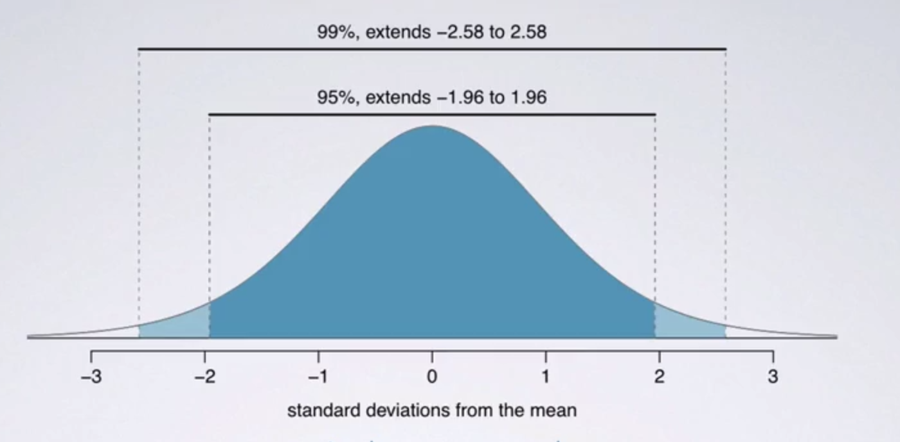
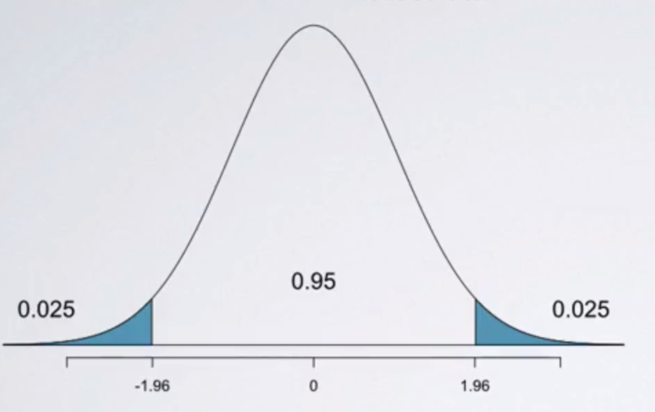
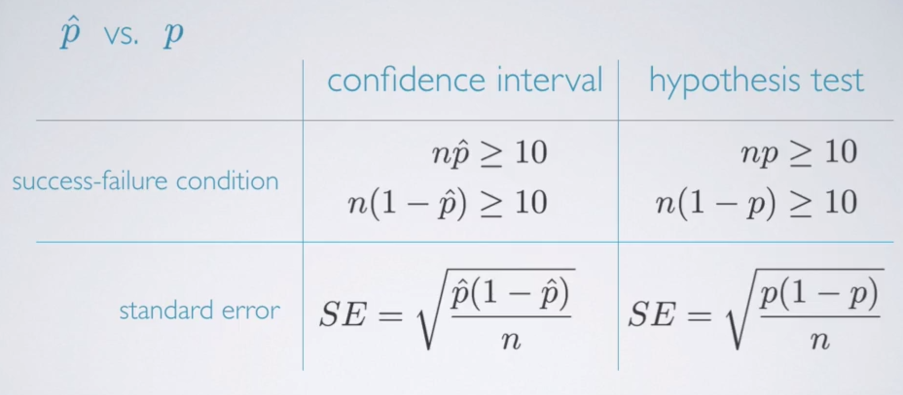
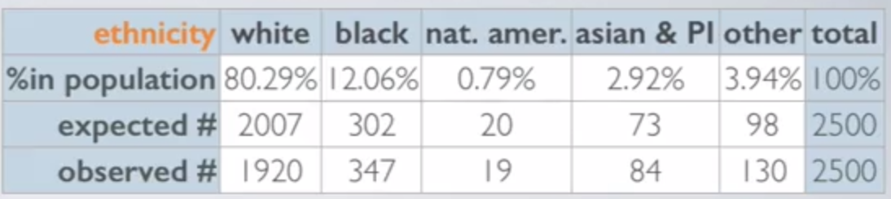
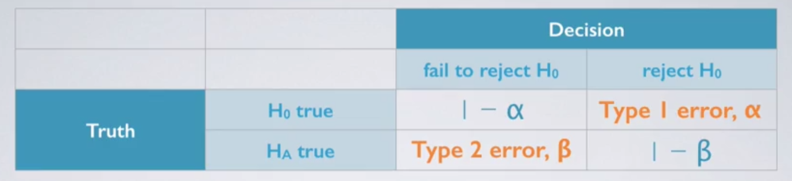

<style type="text/css">
p{ /* Normal  */
   font-size: 18px;
}
body{ /* Normal  */
   font-size: 18px;
}
td {  /* Table  */
   font-size: 14px;
}
h1 { /* Header 1 */
 font-size: 32px;
}
h2 { /* Header 2 */
 font-size: 26px;
}
h3 { /* Header 3 */
 font-size: 22px;
}
code.r{ /* Code block */
  font-size: 14px;
}
pre { /* Code block */
  font-size: 14px
}
</style>


```{r, echo=FALSE, message=FALSE, warning=FALSE}

library(knitr)
opts_chunk$set(message = FALSE, warning = FALSE)

```


# Statistic Inference Basics

## Central Limit Theorem (CLT)

Let’s say you are studying the population of beer drinkers in the US. You’d like to understand the mean age of those people but you don’t have time to survey the entire US population. Instead of surveying the whole population, you collect one sample of 100 beer drinkers in the US. With this data, you are able to calculate an arithmetic mean. Maybe for this sample, the mean age is 35 years old. Say you collect another sample of 100 beer drinkers. For that new sample, the mean age is 39 years old. As you collect more and more means of those samples of 100 beer drinkers, you get what is called a sampling distribution. The sampling distribution is the distribution of the samples mean. In this example, 35 and 39 would be two observations in that sampling distribution.

The theorem states that that if we collect "a large number" of different samples mean from the population, the sampling distribution, the distribution of the samples mean you collected, will approximately take the shape of a bell curve around the population mean no matter what the orginal population distribution is. This shape is also known as a normal distribution. Don’t get the statement wrong. The CLT is not saying that any population will have a normal distribution. It is saying that the sampling distribution will.

To be a little more specific, the sampling distribution of the mean is nearly normal centered at the population mean, with standard error equal to the population standard deviation divided by the square root of the sample size. In the description above, the rule of thumb for the term "a large number" is 30, but may need more if the population distribution is extremely skewed. And at most 10% of the population should be sampled so that we can make sure that our samples are independent of one another.

Knowing that the sampling distribution will take the shape of a normal distribution is what makes the theorem so powerful, as it is the foundation of concepts such as confidence intervals and margins of error in frequentist statistics.


## Confidence Interval

A plausible range of values for the population parameter is called a confidence interval. Example:

> The General Social Survey, the GSS, is a sociological survey used to collect data on demographic characteristics and attitudes of residents of the United States. In 2010, the survey collected responses from 1,154 U.S. residents. Based on the survey results, a 95% confidence interval for the average number of hours Americans have to relax or pursue activities that they enjoy after an average workday, was found to be 3.53 to 3.83 hours.

The general definition of a 95% confidence interval means that **95% of confidence intervals, created based on random samples of the same size from the same population will contain the true population parameter**.

Thus in the context of the problem above, the correct interpretation of the **confidence interval** will be: If we collected many random samples of the same size (1,154 Americans) and calculated a confidence interval for average number of hours Americans spend relaxing after a work day, then we would expect 95% of the intervals to contain the true population average number. Or We are 95% confident that the average number of hours Americans (note that this is refering to the population) spend relaxing after a work day is between 3.53 to 3.83.

The interval is computed using the formula: 

$$\text{point estimate} \pm z * SE$$

Where

- $z$ is called the **critival value** and it corresponds to the **confidence level** that we chose.
- $SE$ represents the **standard error**. Generally the standard error for a point estimate is estimated from the data and computed using a formula. For example, the standard error for the sample mean is $\frac{s}{ \sqrt{n} }$, where $s$ is the standard deviation and $n$ is the number of samples.
- The value $z * SE$ is called the **margin of error**.
- Note that this constructing confidence intervals framework holds true for doing can be easily adapted for any estimator that has a nearly normal sampling distribution. e.g. sample mean, two sample mean, sample proportion and two sample proportion (we'll later see). All we have to do this is change the way that we're calculating the standard error. 

Suppose we took many samples and built a confidence interval from each sample using the equation point estimate plus or minus 1.96 (the **critical value**) times the standard error. Then about 95% of those confidence intervals would be expected to contain the true population mean, the $\mu$ (mu).

The 1.96 is so called the **confidence level** and it is something we choose as oppose to calculate. Commonly used confidence levels in practice are 90%, 95%, 98%, and 99%. Changing the confidence level simply means adjusting the value of the **critical value** in the confidence interval formula. We can compute the **critical value** using `qnorm`.

```{r}

# e.g. the positive and negative critical value for 95%
cl <- 0.95
c(-1, 1) * qnorm( (1 - cl) / 2 )

```

Given these information we can also compute our confidence interval. Example1:

> A sample of 50 college students were asked, how many exclusive relationships they've been in so far? The students in the sample had an average of 3.2 exclusive relationships, with a standard deviation of 1.74. In addition, the same distribution was only slightly skewed to the right. Estimate the true number of exclusive relationships based on this sample using a 95% confidence interval. 

So we're given that 50 college students are in the sample, so N is equal to 50. They had an average of 3.2 exclusive relationships. So the sample mean is 3.2 and the sample standard deviation is 1.74.

```{r}

3.2 + c(1, -1) * qnorm( (1 - cl) / 2 ) * 1.74 / sqrt(50)

```

This means that we are 95% confident. That college students on average have been in 2.72 to 3.68 exclusive relationships. 

Example2:

> Say we are studying the American beer drinkers and we want to know the average age of the US beer drinker population. We hire a firm to conduct a survey on 100 random American beer drinkers. From that sample, we get the following  results: 
> n (sample size): 100
> Standard Deviation of Age: 15
> Arithmetic Mean of Age: 40
> And the question is, what is the probability that the mean age of the US beer drinker population is between 38 and 42?

```{r}

# standard error
se <- 15 / sqrt(100)

# z-score is computed as (value - mean) / standard error
upper <- (42 - 40) / se
lower <- (38 - 40) / se
pnorm(upper) - pnorm(lower)

```

The probability that the mean age of the US beer drinker population is between 38 and 42 is around 81%.

---

Note that the higher the confidence interval, the larger the critical value. Hence the width of the confidence interval also gets wider. Thus if we want to be very certain that we capture the true population parameter, then we raise the confidence level to get a wider interval. Another way of think about this is using the width of the area that captures the middle 95 or 99% of the distribution.



The middle 99% will inevitably span a larger area. And hence the 99% confidence interval is going to be wider. So if we want to increase accuracy, we can increase the confidence level. But this might come at a cost.

Say you're watching the weather forecast, and you're told that the next day the low is negative 20 degrees Fahrenheit, and the high is positive 110 degrees Fahrenheit. Is this accurate? Most likely, yes. Tomorrow's temperature is probably going to be somewhere between negative 20 and positive 110. However, is it informative? or in other words, is it precise? Not really. Based on this weather report it would be near impossible to figure out what to wear tomorrow, or what really to expect in terms of the weather. As the confidence level increases, the width of the confidence interval increases as well which then increases the accuracy. However, the precision goes down. 

Then how can we get the best of both worlds? Is it possible to get higher precision and higher accuracy? Well, of course, yes. The way is to increase the sample size. If we increase our sample size, that's going to shrink our standard error and our margin of error. And therefore we can still remain at a high confidence level while not necessarily needing to increase the width of the confidence interval as well.


## Required Sample Size

Given a target margin of error (denoted as ME), confidence level, and information on the variability of the sample or the population, we can determine the required sample size to achieve the desired margin of error. We do this by plugging known values into the equation of the margin of error and then rearranging things to solve for the unknown and the sample size.

$$
\text{ME} = z * \frac{s}{ \sqrt{n} } \rightarrow 
n = \left( \frac{z * s}{ME} \right) ^2
$$

> Suppose a group of researchers want to test the possible effect of an epilepsy medication taken by pregnant mothers on the cognitive development of their children. As evidence, they want to estimate the IQs of three-year-old children born to mothers who were on this medication during their pregnancy. Previous studies suggest that the standard deviation of IQ scores of three-year-old children is 18 points. How many such children should the researches sample in order to obtain a 90% confidence interval with a margin of error less than or equal to four points? 

```{r}

# 1.65 is the critical value, z, for 90%
(1.65 * 18 / 4) ^ 2

```


However, since we can't really have 0.13 of a person, we're going to need to round this number. Since 55.13 is the minimum required sample size, regardless of the value of the decimal, we always want to round up the number. Therefore, we need at least 56 such children in the sample to obtain a maximum margin of error of four points.

Another critical thing that we can observe from the formula is that: The previous desired margin of error was four and suppose the new desired margin of error is now two points. 

```{r}

# 1.65 is the critical value, z, for 90%
(1.65 * 18 / 2) ^ 2

```

Therefore, to go from four to two, we need to quadruple our sample size. This is important for two reasons. You are going to find yourself in many cases that if we want increase our sample size to get more accurate results. This is indeed true. However, we can see that in order to start really seeing gains from an increased sample size, you may need to really, really increase your sample size. And that's going to take resources.


## Hypothesis Testing

We start with a null hypothesis that we usually call it $H_0$ (H naught) and that represents our status quo. And we also have an alternative hypothesis our $H_1$ that represents the question that we wish to answer, in other word, what we're testing for. We conduct a hypothesis test under the assumption that the null hypothesis is true, either via simulation, or using theoretical methods that rely on the central limit theorem. 

If the test results suggest that the data do not provide convincing evidence for the alternative hypothesis, we stick with the null hypothesis. If they do, then we reject the null hypothesis in favor of the alternative.

Recall from the confidence interval section, we were given the example:

> A sample of 50 college students were asked, how many exclusive relationships they've been in so far? The students in the sample had an average of 3.2 exclusive relationships, with a standard deviation of 1.74. In addition, the same distribution was only slightly skewed to the right. 
> Estimate the true number of exclusive relationships based on this sample using a 95% confidence interval. 

```{r}

# We're able to compute the confidence interval using the following formula
3.2 + c(1, -1) * qnorm( (1 - 0.95) / 2 ) * 1.74 / sqrt(50)

```

This means that we are 95% confident. That college students on average have been in 2.72 to 3.68 exclusive relationships.

So the next question is:

> Based on this confidence interval, do these data support the hypothesis that college students on average have been in more than 3 exclusive relationships? 

We start with setting our hypothesis. Our null hypothesis, $H_0$, is $\mu = 3$. College students have been in three exclusive relationships on average. Our alternative hypothesis, $H_1$, is $\mu > 3$. College students have been in more than three exclusive relationships on average. Note that the hypothesis are always about the population parameters and never about the sample.

Our interval spans from around 2.7 to 3.7, and the null value of 3 is actually included in the interval. The interval says that any value within it could conceivably be the true population mean. Therefore we cannot reject the null hypothesis in favor of the alternative. This is a quick and dirty approach for hypothesis testing. However, it doesn't tell us the likelihood of certain outcomes under the null hypothesis. In other words, it does not tell us the **p-value**.

The **p-value** is defined as **the probability of obtaining the observed or more extreme outcome, given that the null hypothesis is true (not the probability that the alternative hypthesis is true)**. So in context of the data we've been working with, this is the probability of x bar being greater than 3.2, greater than the observed average, given that the true population mean is 3.

```{r}
# standard error = standard deviation / square root of the sample size
se <- 1.74 / sqrt(50)

# z score
z <- (3.2 - 3) / se
pvalue <- pnorm(z, lower.tail = FALSE)
pvalue

```

The p-value for this test is around 0.209. 

If the p-value is low, and by low we mean lower than the significance level $\alpha$, which we usually set at 0.05, but we can certainly change it as well, we say that it would be very unlikely to observe the data if the null hypothesis were true, and therefore we reject the null hypothesis. If on the other hand the p-value is higher than $\alpha$, we say that it is indeed likely to observe the data if the null hypothesis were true. And hence, we would not reject the null hypothesis.

Back to our original question. Our null hypothesis was that college students on average have 3 exclusive relationships, and the alternative was that that number was something greater than 3. From the result we saw that there was a 20.9% chance that a random sample of 50 college students would still yield a sample mean of 3.2 or higher. Since this is a pretty high probability, we think that a sample mean of 3.2 or more exclusive relationships is likely to happen simply by chance.

So in this case we fail to reject the null hypothesis and say that even though we observed a sample mean slightly above 3, there is not enough evidence to reject the null hypothesis.

> A small p-value indicates the data provides strong evidence against the null hypothesis.

p-value is an extremely important concept in frequentist statistics. For those interested, this blog post so covers it with an pizza store example. [Blog: What Are P-Values?](https://prateekvjoshi.com/2013/12/07/what-are-p-values/)

If we're doing two-sided hypothesis test, we can say that the significance level and the confidence level are complements of each other. Think about the most commonly used significance level, 5%, and think about the most commonly used confidence level, 95%. It is not a coincidence that the sum of those two numbers adds up to one. Consider the following graph:




We have a two-sided hypothesis test where we have an alpha of 0.05. This means that at each tail of the normal curve, we can afford to have a tail area of 0.025, so that the total of those tail areas add up to 5%. And usually, when we're thinking about confidence intervals, we're always thinking about the middle whatever percent of the distribution. So a 95% confidence level means that we're interested in the middle 95% of the normal curve.


# Inference For Means

## Comparing Two Means

> We're conducting a distracted eaters study where we compare the average snack consumption of distracted and non-distracted eaters post-lunch. We have a sample of 44 volunteer patients, which are randomized into two equally-sized groups. One group played solitaire on the computer while eating, and the other group was asked to eat their lunch without any distractions. Both groups were provided the same amount of lunch and offered the same amount of biscuits to snack on afterwards. The researchers measured the snack consumption of subjects in each group. The study reports average snack consumption levels for both groups, as well as the standard deviations (provided in the next R code chunk).

Suppose we want to estimate how much more, or less, distracted eaters snack compared to non-distracted eaters. We would use a confidence interval for this, which always takes the form of the point estimate plus or minus a margin of error, where:

- The point estimate is the **difference between the two sample averages**, $\bar{x_1} - \bar{x_2}$.
- The margin of error can be calculated as a critical value ($t_{df}$) times the standard error. Where:
    - the standard error can be computed by $\sqrt{ \frac{s_1^2}{n_1} + \frac{s_2^2}{n_2} }$.
    - the degree of freedom (df) for the t score: $min( n_1 - 1, n_2 - 1 )$, the lower value of the two sample sizes minus 1.
    
We can also conduct a hypothesis test to see if we should reject the $H_0$, which can be phrased as for the average snack consumption for those who eat with and without distraction; the difference between those two is 0.

```{r}

# 1 = solitare, 2 = no distraction
# x = mean, s = standard deviation, n = sample size
x1 <- 52.1
s1 <- 45.1
n1 <- 22
x2 <- 27.1
s2 <- 26.4
n2 <- 22

df <- min(n1 - 1, n2 - 1)
critical <- qt( (1 - 0.95) / 2, df )
se <- sqrt(s1 ^ 2 / n2 + s2 ^ 2 / n2)

# confidence interval
print( (x1 - x2) + c(1, -1) * critical * se )

# hypothesis test
tscore <- (x1 - x2) / se
pt(tscore, df, lower.tail = FALSE) * 2

```

The confidence interval for the average difference was 1.83 to 48.17 and the hypothesis test evaluating a different between the two means yielded a p-value of roughly 4%. Which means that we would reject the null hypothesis and conclude that these data do indeed provide convincing evidence that there is a difference between the average snack intake of distracted and non-distracted eaters. 

The results of the confidence interval and the hypothesis test do in fact agree. We rejected the null hypothesis that set the difference between the two means equal to 0, and therefore this null value should not be included in our confidence interval and indeed it's not.

Note that the formula listed in this section is used when the **two groups are independent of one another (not paired)**. e.g. If we wish to compare pre- (beginning of semester) and post-test (end of semester) scores of students, then this will require a paired t-test.


## Comparing Multiple Means (ANOVA)

Sometimes we want to compare means across many groups. A new method to do this is called **analysis of variance (ANOVA)** and a new test statistic called F. ANOVA uses a single hypothesis test to check whether the means across many groups are equal:

- $H_0$: The mean outcome is the same across all groups. In statistical notation, $\mu_1 = \mu_2 = ... = \mu_k$ where $\mu_i$ represents the mean of the outcome for observations in category $i$.
- $H_A$: At least one mean is different.

In order to be able to reject the null hypothesis, we need to obtain a large F statisitc (a small p value), which requires that the variability between groups be much larger than the variability within groups.

List the conditions necessary for performing ANOVA

- the observations should be independent within and across groups.
- the data within each group are nearly normal.
- the variability across the groups is about equal.

> As an example we consider one of the data sets available with R relating to an experiment into plant growth. The purpose of the experiment was to compare the yields on the plants for a control group and two treatments of interest. The response variable was a measurement taken on the dried weight of the plants.

```{r, message=FALSE, warning=FALSE}

library(ggplot2)

# built-in data PlantGrowth
plant_df <- PlantGrowth
plant_df$group <- factor( plant_df$group,
						  labels = c('Control', 'Treatment 1', 'Treatment 2') )

ggplot( plant_df, aes(x = group, y = weight) ) + 
geom_boxplot()

```

Initial inspection of the data suggests that there are differences in the dried weight for the two treatments but it is not so clear cut to determine whether the treatments are actually different to the control group.

```{r}

anova_test <- aov(weight ~ group, data = plant_df)
summary(anova_test)

```

Here, the p-value is small, thus we reject the null hypothesis and say that we have sufficient evidence for the alternative. More explicitly, the data DO provide convincing evidence that at least one pair of population means are different from each other.

Note that ANOVA only answers whether there is evidence of difference in at least one pair of groups, it doesn't tell us which groups are different. Hence when we reject the null hypothesis in an ANOVA analysis, we might wonder, which of these groups have different means? To answer this question, we compare the means of each possible pair of groups. These comparisons can be accomplished using a two-sample t-test, but we need to use a **modified significance level**. Since if we were to conduct multiple pairwise comparisons, it is likely that we will eventually find a difference just by chance, even if there is no difference in the populations.

The **Bonferroni correction** suggests that a more stringent significance level is more appropriate for these multiple comparisons tests:

$$\alpha^* = \alpha / K$$

Where $K$ is the number of comparisons being considered. If there are k groups, then usually all possible pairs are compared and $K = \frac{k(k - 1)}{2}$.

```{r}

# the quickest way to do this "post-hoc" multiple
# comparison test
TukeyHSD(anova_test)

```


# Inference For Proportions

> We're told that 90% of all plant species are classified as angiosperms. These are flowering plants. If you were to randomly sample 200 plants from the list of all known plant species, what is the probability that at least 95% of the plants in your sample will be flowering plants?

The sampling distribution $\hat{p}$ taken from a sample of size $n$ from a population with a true proportion $p$, is nearly normal when:

1. The sample observations are independent
2. We expected to see at least 10 successes and 10 failures in our sample, i.e. $np$ and $n(1 - p)$. This is called the success-failure condition.

If these conditions are met, we can conclude that the sampling distribution of $\hat{p}$ is nearly normal with mean $p$ and standard error of $\sqrt{ \frac{ p ( 1 - p ) }{n} }$. **Note that it uses $p$ instead of $\hat{p}$** to compute the standard error. There is a slight difference of when to use which, and it is depicted in the following table:



This is a important notion in proportion testing, because unlike doing inference for means, the point estimate $\mu$ does not appear in the calculation for the standard error. For the proportion testing, it does.

```{r}

n  <- 200
p  <- 0.9
se <- sqrt( p * (1 - p) / n )

zscore <- (0.95 - p) / se
pnorm(zscore, lower.tail = FALSE)

```

> A university newspaper is conducting a survey to determine what fraction of students support a $200 per year increase in fees to pay for a new football stadium. How big of a sample is required to ensure the margin of error is smaller than 0.04 using a 95% confidence level?

If we have an estimate of the population proportion $p$, perhaps from a similar survey, we could enter in that value and solve for $n$. If we have no such estimate, we must use some other value for $p$. It turns out that the margin of error is largest when $p$ is 0.5, so we typically use this worst case value if no estimate of the proportion is available. Recall that the formula for computing the margin of error for the proportion is:

$$\text{ME} = z *\sqrt{ \frac{ p ( 1 - p ) }{n} }$$

```{r}

me <- 0.03
p  <- 0.5
ci <- 0.95

# here, p and 1 - p is the same, thus we can use p squared
( qnorm( 0.95 + (1 - ci) / 2 ) * p / me ) ^ 2

```

## Hypothesis Test

> A 2013 Pew Research poll found that 60% of 1,983 randomly sampled American adults believe in evolution. Does this provide convincing evidence that majority (more than 50%) of Americans believe in evolution?

Our alternative hypothesis should state $p$ is greater than 0.5. We are also given that sample proportion is 0.6. So, what we are checking to see is, does this particular sample yield convincing evidence that the majority of Americans believing in evolution.

```{r}

n <- 1983
p <- 0.5
se <- sqrt(  p * (1 - p) / n )
zscore <- (0.6 - p) / se
pnorm(zscore, lower.tail = FALSE)

```

Remember that p-value = P( observed or more extreme outcome | null hypthesis is true ). This shows that there is almost 0% chance of obtaining a random sample of 1983 Americans where 60% or more believe in evolution, if in fact 50% of the American believe in evolution.


## Chi-Square

In a **Chi-Square goodness of fit test, we evaluate the distribution of one categorical variable that has more than two levels**.

When dealing with counts and investigating how far the observed counts are from the expected counts, we use this new test statistic called the **chi-square** statistic.

$$\chi^2 = \sum_{i=1}^{k} \frac{(O_i - E_i)^2}{E_i}$$

It's calculated as the observed minus the expected for each cell squared divided by the expected counts and we want to sum this over all of the cells (levels of the categorical variable).

The chi-squared distribution has only one parameter, the degrees of freedom. It influences the shape, the center and the spread of the chi-square distribution. And for goodness of fit test, the degrees of freedom can be calculated as $k-1$, where k stands for the number of cells.

The conditions are exactly the same between the chi-square goodness of fit test and the chi-square test of independence as we'll later see. 

- Independence, where we think about sampled observations having to be independent of each other. We can ensure this by random sampling or assignment. And each case should only contributes to one cell in the table
- We want to make sure that our sample size is less than 10% of our population.
- We want to make sure that each particular scenario or cell has at least five expected counts. 

> In a county where jury selection is supposed to be random, a civil rights group sues the county, claiming racial disparities in jury selection. Distribution of ethnicities of people in the county who are eligible for jury duty based on census results and distribution of 2500 people who were selected for jury duty in the previous year are given in the table below.



So we can see that in this population, we have 80.29% whites 12.06% blacks, 0.79% Native Americans, 2.92% Asians and Pacific islanders, and 3.94% other ethnicities. And for the observed count: 1,920 were white, 347 were black, 19 were native America, 84 were Asian and Pacific Islander, and 130 were categorized as other race or ethnicity.

We again start by setting up the hypothesis test:

- $H_0$: The observed counts of jurors from various race ethnicities follow the same ethnicity distribution in the population.
- $H_A$: The observed counts of jurors from various ethnicities, do not follow the same race ethnicity distribution in the population.


```{r}

obs <- c(1920, 347, 19, 84, 130)

# expected probability distribution
prob <- c(0.8029, 0.1206, 0.0079, 0.0292, 0.0394)
chisq.test(x = obs, p = prob)

```

In a **Chi-Square independent test, we evaluate the distribution of two categorical variable that has more than two levels**.

The computation for the independent test is exactly the same as the goodness of fit test (The expected count for the two way table is computed as *row total * column total / table total*). What is different, however, is how we calculate the degrees of freedom (df). Remember with the chi square goodness of fit test, the degrees of freedom was simply $k- 1$, with $k$ being the number of cells. In this case because we have a two-way table, we need to consider the number of levels for both of the categorical variables. So the degrees of freedom is calculated as the number of rows minus one times number of columns minus one. Denoted as $( r - 1 ) * ( c - 1 )$.


With a small p value, we reject the null hypothesis in favor of the alternative. Which means that these data provide convincing evidence that the two categorical variable are associated. Note that this type of analysis is not sufficient to deduce a causal relationship as there might be other confounding factors.


# Decision Errors And Powers

Just like court cases, hypothesis tests are not flawless. In the court system, innocent people sometimes are wrongly convicted and sometimes the guilty walk free. Similarly, we can make wrong decision in statistical hypothesis tests as well. The difference, though, is that we have the tools necessary to quantify how often we make errors in statistics, which is type I and type II errors. Consider the following truth versus decision contingency table:


If the null hypothesis is indeed true and you fail to reject it, you've done the right thing (denoted by the check mark). There's absolutely no reason to worry. Similarly, if the alternative hypothesis is true and you reject the null hypothesis in favor of the alternative, once again, you've done the right thing. The other two cells denotes:

- **Type I error** is rejecting the null hypothesis when the null hypothesis is actually true. So in other words, rejecting the null hypothesis when you should not have. 
- **Type II error** is failing to reject the null hypothesis when the alternative is true. In other words, it's failing to reject the null hypothesis when you shouldn't have.

> Consider a criminal trial: The null hypothesis says that the defendant is innocent. The alternative says that the defendant is guilty. Which type of error is being committed in the following circumstances? 
> 1. Declaring the defendant innocent when they are actually guilty.
> 2. Declaring the defendant guilty when they're actually innocent.

This means that we are failing to reject the null hypothesis when the alternative is actually true, which is a type II error. And the converse of that is declaring the defendant guilty when they're actually innocent. So in this case, we have rejected the null hypothesis in favor of the alternative when the null was true and that is the definition of a type one error.

As a general rule, we reject the null hypothesis when the p-value is less than .05. In other words, we set our significance level, our $\alpha$, to .05. This means that, for those cases where the null hypothesis is actually true, we do not want to incorrectly reject it more than 5% of those times. 

In other words, when using a 5% **significance level**, there is about a 5% chance of making a type I error if the null hypothesis is true. This is why we prefer small values of alpha. Because if we were to increase $\alpha$ that might sound good because that would allow us to reject our null hypothesis more often which is usually what we are trying to do. However, we would also be inflating our type I error rate.

Returning back to our truth versus decision contingency table:



A type I error, is rejecting the null hypothesis when we shouldn't have. And the probability of doing so is $\alpha$, our **significance level**. The type II error is failing to reject the null hypothesis when we should have and the probability of doing so is labeled $\beta$ (Note that this is not something we get to set ahead of time during the hypothesis testing). 

On the other hand, **power** is the probability of correctly rejecting the null hypothesis and the probability of doing so is $1 - \beta$. If the alternative hypothesis is true, there are one of two things you can do. You might commit a type II error, and the probability of doing so is $\beta$, or you might correctly reject the null hypothesis in favor of the alternative, and the probability of that, then, is going to be the complement of $\beta$, $1- \beta$. And that's what we call our **power**.

In general, our goal in hypothesis testing is to keep both $\alpha$ and $\beta$ low at the same time. But the likelihood of making a type I error and likelihood of making a type II error are actually inversely proportional. Hence, sometimes we have to choose between which one we are okay with being a little higher versus which one we really want to minimize as much as possible.

e.g. For the criminal trial example if the jury's mindset is: It's Better that 10 guilty persons escape than one innocent suffer, that means we want to minimize the type I error (Declaring the defendant guilty when they're actually innocent).


---

Another caveat is that, even if we have a small **effect size** (difference between the point estimate and the null value), which may not be practically significant. We can still find the statistically significant result simply by inflating our sample size. Thus, we should do some a-priori analysis to determine how many observations to collect. e.g.

```{r}

# x bar is 50
# standard deviation is 2
# H0: mu = 49.5, H1: mu > 49.5
x  <- 50
sd <- 2
mu <- 49.5

# consider different sample size
# first a sample size of 100
z1 <- (x - mu) / ( sd / sqrt(100) )
print(z1)

# then inflate it to 10000 and 
# see the difference between the z score,
# recall that the higher the z score the lower
# our p-value
z2 <- (x - mu) / ( sd / sqrt(10000) )
print(z2)

```


> A pharmaceutical company has developed a new drug for lowering blood pressure and they are preparing a clinical trial to test the drug's effectiveness. They recruit people who are taking a particular standard blood pressure medication, and half of the subjects are given the new drug, this is the treatment group. And the other half continued to take their medication through generic-looking pills to ensure blinding, this is our control group. Previously published studies suggest that the standard deviation of the patients' blood pressures will be about 12 millimeters of mercury. Suppose that the company researchers care about finding any effect on blood pressure that is 3 millimeters of mercury or larger cersus the standard medication. Then what is the minimum required sample size for a desired level of power 80%.

```{r}

power.t.test(power = 0.8, sig.level = 0.05, delta = 3, sd = 12)

```

# R Session Information

```{r}
devtools::session_info()
```


# Reference

- [Coursera: Inference Statistics](https://www.coursera.org/learn/inferential-statistics-intro)
- [Blog: What Are P-Values?](https://prateekvjoshi.com/2013/12/07/what-are-p-values/)
- [Blog: One-way Analysis of Variance](http://www.r-bloggers.com/one-way-analysis-of-variance-anova/)
- [Blog: The Theorem Every Data Scientist Should Know](http://www.jeannicholashould.com/the-theorem-every-data-scientist-should-know-2.html)
- [Notes: Power and sample size calculation for t test in R](http://users.stat.umn.edu/~corbett/classes/3022/Power_and%20_sample_size_for_t_in_R.txt)

